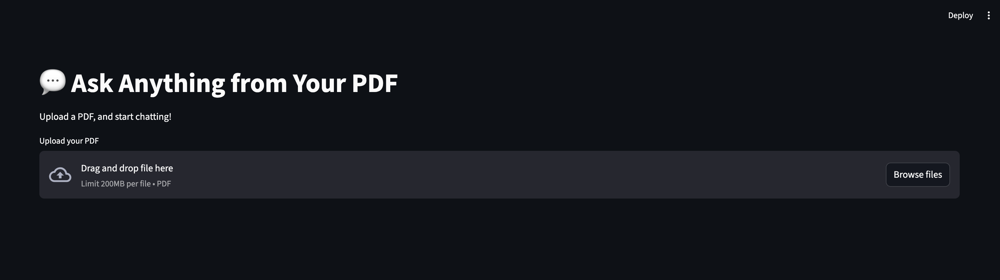
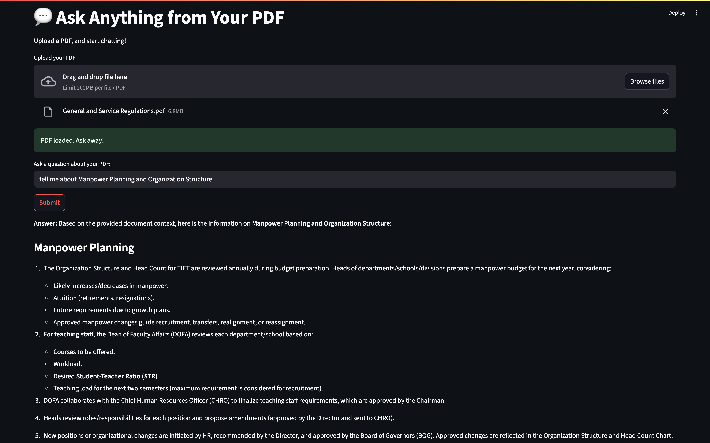

# 💬 Chat With Your PDF — Streamlit + LangChain + Together AI

Talk to your PDFs like a boss. This app lets you upload any PDF and ask questions about its content — powered by Retrieval-Augmented Generation (RAG) with LangChain, embeddings from HuggingFace, and open-source LLMs from Together AI.

---


## 🧠 Features

- 📄 Upload any PDF and ask questions about it
- 🔍 Fast, local embedding with `all-MiniLM-L6-v2`
- 🤖 Together AI models like `deepseek-ai/DeepSeek-V3` for responses
- 💾 Vector search powered by FAISS

---
### PDF Chatbot Demo Screenshots

**1st Image:**



**2nd Image:**




## 🛠️ Tech Stack

| Tool | Purpose |
|------|---------|
| [Streamlit](https://streamlit.io) | Web frontend |
| [LangChain](https://www.langchain.com/) | RAG framework |
| [Together AI](https://www.together.ai/) | Free LLMs |
| [FAISS](https://github.com/facebookresearch/faiss) | Vector database |
| [HuggingFace Sentence Transformers](https://www.sbert.net/) | Embeddings |
| [PyPDF](https://pypi.org/project/pypdf/) | PDF parsing |

---
## 🚀 Live Demo

👉 [**Try it here**](https://pdf-chatbot-lzmg7it6jn3axsrcnzepuu.streamlit.app/) — no setup needed!  
Upload any PDF and start chatting with it in seconds.

---

## 🧪 Local Setup

### 1. Clone the repo

```bash
git clone https://github.com/Prince-05/pdf-chatbot
cd pdf-chatbot
```

### 2. Create `.env` file

```env
# .env
TOGETHER_API_KEY=your_together_api_key_here
```

### 3. Create virtual environment

```bash
python3 -m venv venv
source venv/bin/activate
```

### 4. Install dependencies

```bash
pip install -r requirements.txt
```

### 5. Run locally

```bash
streamlit run app.py
```

---
---

## 🧠 Example Use Cases

| Use Case | Description |
|----------|-------------|
| Research Papers | Upload a paper and ask “what’s the methodology?” |
| Job Applications | Ask your CV “what skills do I mention most?” |
| Class Notes | Upload your PDF notes and quiz yourself |
| Contracts | Ask “what are the penalties?” or “who’s responsible?” |

---

## 📜 License 
                     
MIT License — free to use, modify, and deploy. Just don’t sell it to your cousin as a startup and forget to invite me to Shark Tank.

---

## 🙌 Author

Built by [Princy](https://github.com/Prince-05) with frustration, caffeine, and a dream to bully PDFs back.
